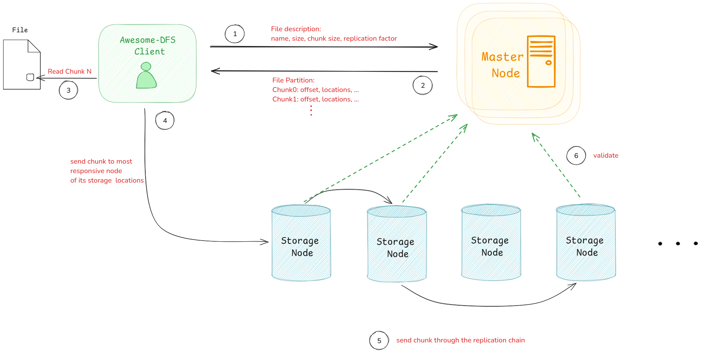
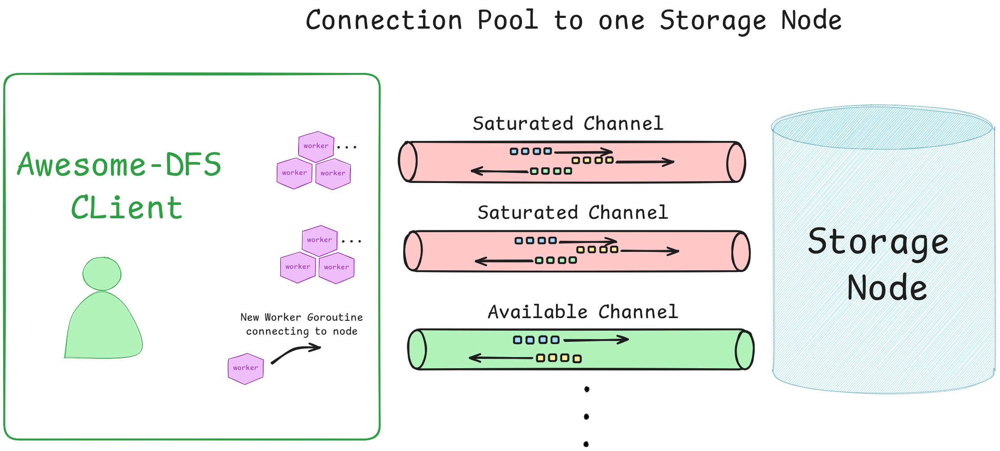

# Awesome DFS

**Awesome DFS** is a distributed file system designed to safely store files across multiple locations, with fault tolerance features. 
Built using **Golang** and **gRPC**, Awesome DFS enables users to manage large datasets efficiently.

## Key Features

- **Replication**: A replication chain forwards chunks between nodes to ensure redundant copies exist.
- **Scalability**: Easily add new storage nodes to accommodate growing data.
- **Connection Pooling**: Efficient connection management to avoid channel saturation when handling gRPC calls.
- **Client-Server Architecture**: The client interacts with storage and master nodes to handle file uploads and downloads.

## Architecture Overview

### File Upload Process

1. **Client Request**: The client sends file metadata and replication/striping details to the master node.
2. **Partitioning**: The master node partitions the file into chunks and determines the replication locations (the replication chain).
3. **Chunk Transmission**: The client spawns worker goroutines to send chunks to the head storage node in each replication chain. The storage nodes forward the chunks to subsequent nodes.
4. **Completion**: The master node validates the file's successful storage across the nodes.

### File Download Process

1. **Client Request**: The client requests the file from the master node, which provides the previously stored partition details.
2. **Chunk Retrieval**: The client uses multiple workers to retrieve chunks from the storage nodes.
3. **Reconstruction**: The client writes the chunks back into the file.

### Connection Pooling

When the client interacts with storage nodes, each gRPC connection has a concurrent call limit of a 100. To maintain performance, Awesome DFS employs a **connection pool manager** that assigns a non-saturated connection to new worker goroutines or creates a new connection if all existing ones are saturated. This ensures balanced load distribution and optimized resource usage.

### Upcoming Features

- **Garbage Collection**: Automatically remove untracked or orphaned file chunks.
- **Chunk Correction**: Detect and correct corrupted chunks in the storage system.
- **File System Support**: Introduce hierarchical storage with folders and directory trees.
- **CLI with Cobra**: Implement a command-line interface using Cobra for easier interaction.
- **Dockerized Storage Nodes**: Simplify node configuration and addition using Docker containers.

